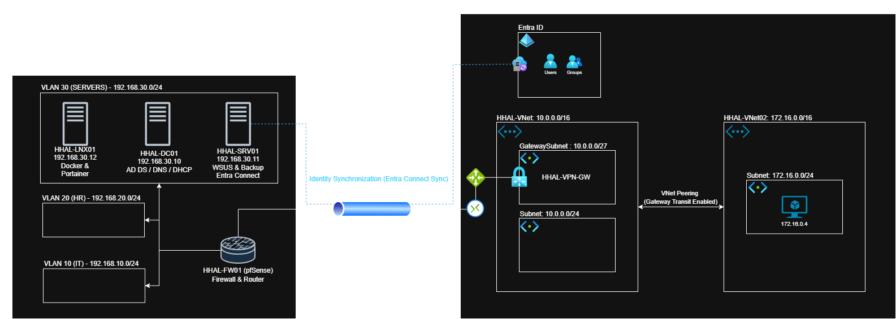
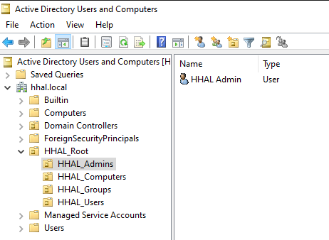
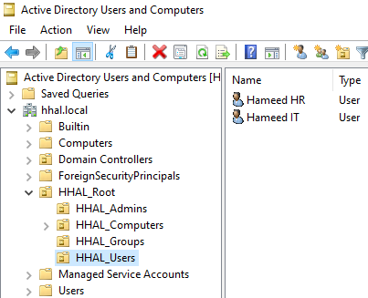
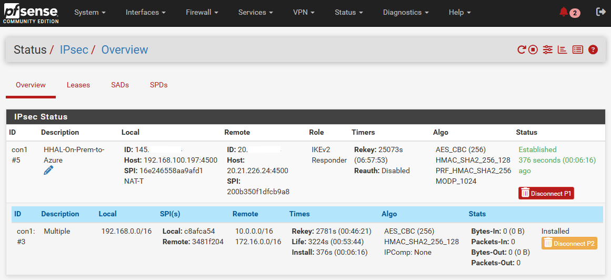
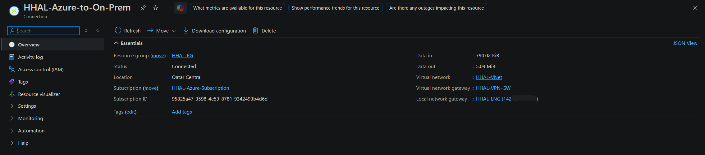
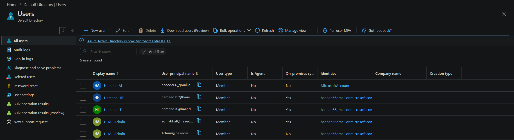
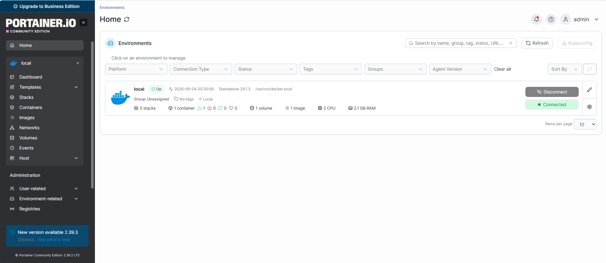

# HHAL Hybrid Cloud Project

An enterprise-grade Hybrid Cloud Infrastructure project demonstrating the integration of an On-Premises virtualized environment (via VirtualBox & pfSense) with Microsoft Azure using a secure Site-to-Site (IPsec) VPN and Entra ID identity synchronization.

---

## ☁️ Azure Architecture

### 🗂️ Resource Group & Subscription
* **Resource Group:** `HHAL-RG`
* **Subscription:** `HHAL-Azure-Subscription`

### 🌐 Cloud Networking
* **Hub VNet:** `HHAL-VNet` (Address Space: `10.0.0.0/16`)
  * **Subnet:** `10.0.0.0/24`
  * **GatewaySubnet:** `10.0.1.0/27`
* **Spoke VNet:** `HHAL-VNet02` (Address Space: `172.16.0.0/16`)
  * **Subnet:** `172.16.0.0/24`
* **VNet Peering:** `HHAL-Peering` (Configured between Hub & Spoke with Gateway Transit enabled)

### 🔒 VPN Gateway & Connectivity Cryptography
* **Virtual Network Gateway:** `HHAL-VPN-GW` (Generation 1, SKU: `VpnGw1AZ`, Route-based)
* **Local Network Gateway:** `HHAL-LNG` (Targeting On-Prem Public IP, Address Space: `192.168.0.0/16`)
* **Connection Profile:** `HHAL-Azure-to-On-prem` (Site-to-Site IPsec Tunnel)
  * **IKE Phase 1 (Main Mode):** AES256 | SHA256 | DH Group 2
  * **IKE Phase 2 (IPsec Data):** AES256 | SHA256 | PFS Group 2

### 🖥️ Azure Virtual Machines
* **VMLNX01:** Ubuntu Server (Private IP: `172.16.0.4` mapped inside `HHAL-VNet02`)

---

## 🏢 On-Premises Infrastructure (VirtualBox)

### 🛡️ Firewall & Core Router: `HHAL-FW01` (pfSense)
* **WAN Interface (em0):** `192.168.100.197/24` (Bridged to Physical ISP Router)
* **LAN Interface (em1):** `192.168.1.1/24` (Internal Management Segment: `hhal-int`)
* **VLAN 10 (IT Zone):** `192.168.10.1/24`
* **VLAN 20 (HR Zone):** `192.168.20.1/24`
* **VLAN 30 (SERVERS Zone):** `192.168.30.1/24`

---

## 📂 Detailed Documentation Directory

The complete modular design and engineering steps are mapped directly to the active documentation logs:

### 1. [Network Architecture & Hybrid VPN Configuration](documentation/networking-vpn.md)
* **Core Deliverables:** Enterprise pfSense localized VLAN tagging (10, 20, 30) and secure hybrid-cloud IPsec tunnel configuration linking the on-premise gateway to Azure Virtual Network Gateways.

### 2. [Active Directory Core Domain Infrastructure](documentation/active-directory.md)
* **Core Deliverables:** Multi-tier domain configuration mapping `hhal.local`, organizational unit (OU) design blueprints, and identity baseline structures.

### 3. [Group Policy Management & Object Enforcement](documentation/group-policy-objects.md)
* **Core Deliverables:** Global Group Policy Objects (GPOs) administration including drive mapping logic (S:, I:, H:) and localized security baselines.

### 4. [System Updates & Backup Infrastructure](documentation/wsus-backups.md)
* **Core Deliverables:** WSUS localized patching strategy for Windows clients and automated daily system state recovery procedures.

### 5. [Containerization & Infrastructure Monitoring](documentation/containerization-monitoring.md)
* **Core Deliverables:** Centralized container orchestration via Portainer CE and real-time infrastructure telemetry monitoring for the Linux service tier.

---

## 🆔 Identity & Core Active Directory Services

#### 1️⃣ Domain Controller: `HHAL-DC01` (Windows Server 2022)
* **Network IP Address:** `192.168.30.10` (Assigned to VLAN 30)
* **Core Roles Deployed:** Active Directory Domain Services (Domain: `hhal.local`), Integrated DNS, Centralized DHCP Server.
* **Organizational Unit (OU) & Directory Hierarchy:**
  * `HHAL_Admins` -> Target User: `HHAL Admin`
  * `HHAL_Users` -> Target Users: `Hameed IT`, `Hameed HR`
  * `HHAL_Groups` -> Security Groups: `IT_Group`, `HR_Group`

#### 2️⃣ Management & Backup Node: `HHAL-SRV01` (Windows Server 2022)
* **Network IP Address:** `192.168.30.11` (Assigned to VLAN 30)
* **Core Roles Deployed:** WSUS (Automated Endpoint Patching), Scheduled Enterprise Backups (Execution runtime: 12:00 AM).
* **Hybrid Identity Engine:** Microsoft Entra Connect Sync Agent (Automating On-Premise AD object sync directly to Microsoft Entra ID).

#### 3️⃣ Linux Infrastructure Node: `HHAL-LNX01` (Ubuntu Server)
* **Network IP Address:** `192.168.30.12` (Assigned to VLAN 30)
* **Current Status:** Provisioned and prepared for Containerized DevOps workflows. Undergoing Docker Engine initialization and Portainer CE orchestration deployment.

#### 4️⃣ Domain Deployed Workstations (DHCP Infrastructure)
* **Windows Desktop:** `HHAL-CL01` (Successfully joined to the `hhal.local` Active Directory Domain)
* **Linux Desktop:** `HHAL-LX01` (Successfully integrated with the `hhal.local` Active Directory Domain)

---

## 📸 Project Evidence

| Service | Screenshot |
| :--- | :--- |
| **Domain Admin, Users** |    |
| **VPN Status** |  |
| **Azure Gateway** |  |
| **Entra Sync** |  |
| **Portainer UI** |  |
