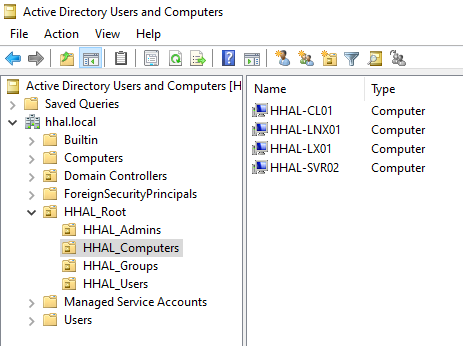
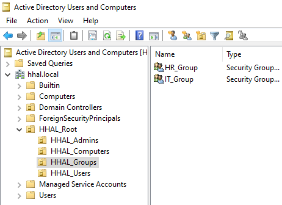

# HHAL Hybrid Cloud Project

An enterprise-grade Hybrid Cloud Infrastructure project demonstrating the integration of an On-Premises virtualized environment (via VirtualBox & pfSense) with Microsoft Azure using a secure Site-to-Site (IPsec) VPN and Entra ID identity synchronization.

---

## ☁️ Azure Architecture

### 🗂️ Resource Group & Subscription
* **Resource Group:** `HHAL-RG`
* **Subscription:** `HHAL-Azure-Subscription`

### 🌐 Cloud Networking
* **Hub VNet:** `HHAL-VNet` (Address Space: `10.0.0.0/16`)
  * **Subnet:** `10.0.0.0/24`
  * **GatewaySubnet:** `10.0.1.0/27`
* **Spoke VNet:** `HHAL-VNet02` (Address Space: `172.16.0.0/16`)
  * **Subnet:** `172.16.0.0/24`
* **VNet Peering:** `HHAL-Peering` (Configured between Hub & Spoke with Gateway Transit enabled)

### 🔒 VPN Gateway & Connectivity Cryptography
* **Virtual Network Gateway:** `HHAL-VPN-GW` (Generation 1, SKU: `VpnGw1AZ`, Route-based)
* **Local Network Gateway:** `HHAL-LNG` (Targeting On-Prem Public IP, Address Space: `192.168.0.0/16`)
* **Connection Profile:** `HHAL-Azure-to-On-prem` (Site-to-Site IPsec Tunnel)
  * **IKE Phase 1 (Main Mode):** AES256 | SHA256 | DH Group 2
  * **IKE Phase 2 (IPsec Data):** AES256 | SHA256 | PFS Group 2

### 🖥️ Azure Virtual Machines
* **VMLNX01:** Ubuntu Server (Private IP: `172.16.0.4` mapped inside `HHAL-VNet02`)

---

## 🏢 On-Premises Infrastructure (VirtualBox)

### 🛡️ Firewall & Core Router: `HHAL-FW01` (pfSense)
* **WAN Interface (em0):** `192.168.100.197/24`
* **LAN Interface (em1):** `192.168.1.1/24`
* **VLAN 10 (IT Zone):** `192.168.10.1/24`
* **VLAN 20 (HR Zone):** `192.168.20.1/24`
* **VLAN 30 (SERVERS Zone):** `192.168.30.1/24`

---

## 🆔 Identity & Core Active Directory Services

* **Domain Controller (`HHAL-DC01`):** IP `192.168.30.10` | Domain: `hhal.local`
* **Management & Backup (`HHAL-SRV01`):** IP `192.168.30.11` | WSUS & Entra Connect
* **Linux Infrastructure (`HHAL-LNX01`):** IP `192.168.30.12` | Docker/Portainer

---

## 📸 Project Evidence

| Service | Screenshot |
| :--- | :--- |
| **Domain Admin** |  |
| **Computers** |  |
| **Groups** |  |
| **Users** |  |
| **VPN Status** |  |
| **Azure Gateway** |  |
| **Entra Sync** |  |
| **Portainer UI** |  |

---

## 📂 Documentation Logs
- [Network & VPN](documentation/networking-vpn.md)
- [Active Directory](documentation/active-directory.md)
- [GPOs](documentation/group-policy-objects.md)
- [WSUS & Backups](documentation/wsus-backups.md)
- [Containerization](documentation/containerization-monitoring.md)
